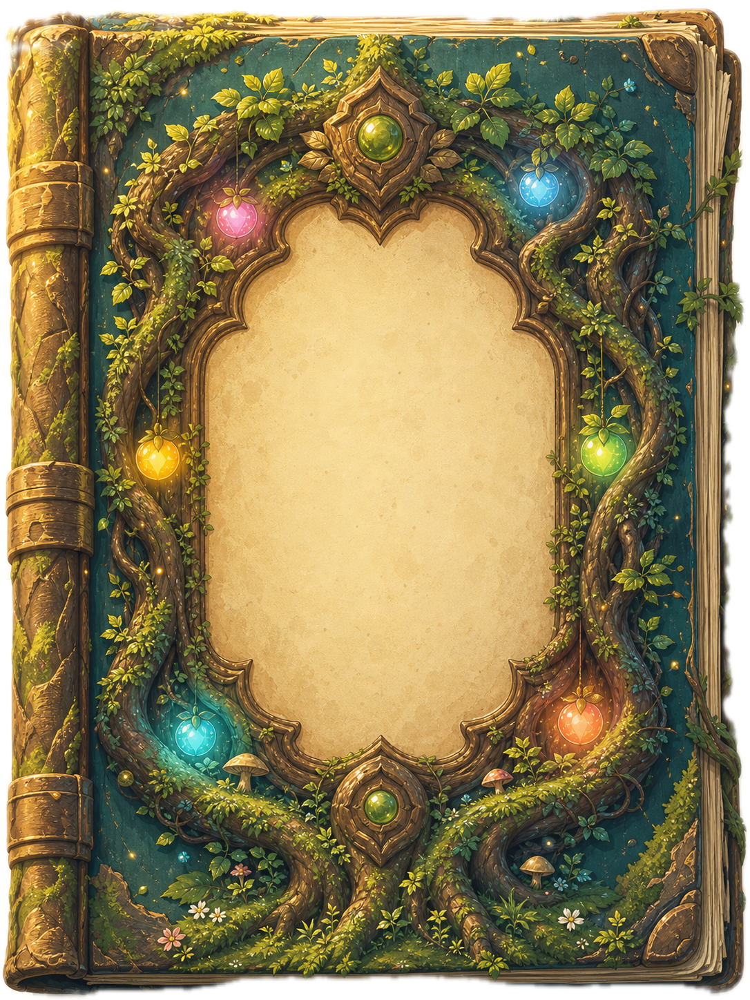

# DESIGN — 前端視覺與互動規範

本檔定義 `qa-storming` 的設計語言。Claude、Codex 或其他協作者進行任何 UI、圖片、動畫、RWD 或文案工作前，都必須先閱讀本檔；風格方向改變時同步更新。

## 1. 設計定位

`QA Storming — Guild Knowledge Archive` 是一座讓 QA 成員探索知識的奇幻公會世界，不是一般企業 Dashboard。

核心感受：

- **奇幻、溫暖、可探索**：像進入繪本或 RPG 城鎮，而不是進入後台。
- **自然魔法**：生命樹、森林、石台、卷軸、魔法書、光點與小動物共同構成世界。
- **清楚可信**：沉浸感不能犧牲文件可讀性、操作回饋或資訊層級。
- **同一個世界**：首頁、產品地圖、試煉之森與文件頁都應像同一套遊戲的不同場景。

參考方向可來自溫馨奇幻 RPG、日系冒險遊戲與童話繪本，但不得直接複製既有遊戲的角色、Logo、UI 素材或辨識性構圖。

## 2. 圖片主導原則

場景與主要物件優先使用一致畫風的圖片，CSS 負責排版、光影、霧氣、粒子、景深與互動狀態，JSX／TypeScript 負責資料與操作狀態。

```text
圖片：世界、場景、主要物件與材質
CSS：排版、視差、光影、粒子、聚焦、過場
JSX：狀態、資料、鍵盤、拖曳與可及性
```

### 應使用圖片

- 生命樹、傳送門、世界地圖等大場景
- 魔法書、石製機關等主要互動物件
- 狼、蝙蝠、史萊姆、巨龍等角色 sprite
- 需要插畫筆觸、木紋、苔蘚、葉片或石材質感的物件

### CSS 適合處理

- 漸層遮罩、背光、霧氣、光暈與暗角
- 發光粒子、細微漂浮、focus／hover 狀態
- 空間排版、偽 3D transform、景深與視差
- 卷軸／羊皮紙資訊面板的簡單邊框與陰影

### 避免

- 用大量 CSS 幾何圖形重畫主要場景或大型物件
- 同一畫面重複出現兩個功能與造型相近的實體控制器
- 寫實照片、扁平 SaaS 插圖、霓虹賽博龐克或塑膠感 3D 混入主風格
- 把文字直接生成在插畫內；介面文字應由 HTML 呈現

## 3. 核心視覺資產

| 資產 | 用途 | 視覺要求 |
| --- | --- | --- |
| `public/rpg-life-tree.png` | 首屏生命樹 | 溫暖晨光、青綠森林、清楚主樹輪廓 |
| `public/rpg-trial-portal.png` | 試煉之森背景 | 深色遺跡森林、中央傳送門、既有石台留作巨龍舞台 |
| `public/rpg-trial-portal-mobile.png` | 試煉之森手機背景 | 與桌機版同場景的直式 art direction，完整保留門洞與石台 |
| `public/rpg-trial-portal-alpha.png` | 試煉之森桌機前景 | 保留森林、石門與平台，中央門洞透明，領域景色置於其下 |
| `public/rpg-trial-portal-mobile-alpha.png` | 試煉之森手機前景 | 直式透明門洞版本，門框與 HUD 仍按手機構圖校準 |
| `public/rpg-product-world-map.png` | 產品世界地圖 | 與生命樹一致的繪本筆觸、自然地貌與金色日光 |
| `public/rpg-quest-book.png` | 任務書封面 | 苔蘚、藤蔓、寶石、舊書材質，中央留可讀文字區 |

<p>
  
  
</p>
<p>
  
  
</p>

新增場景圖片時，桌機優先沿用 `1672 × 941`、約 `16:9` 的橫幅比例；若核心物件無法在手機裁切中完整保留，需另製直式 art-directed sibling asset，不得用過度放大或拉伸勉強共用。圖片需先壓縮，在不明顯破壞插畫筆觸的前提下降低檔案大小。

## 4. 色彩系統

現有基礎 token 位於 `src/app/globals.css`：

| Token | 色碼 | 用途 |
| --- | --- | --- |
| `--forest` | `#1d463b` | 深森林背景、主要深色 |
| `--ink` | `#263c35` | 主要文字 |
| `--cream` | `#fff8dc` | 羊皮紙、亮色文字 |
| `--gold` | `#d9a64d` | 獎勵、重點、魔法光 |
| `--mint` | `#7fd3a7` | 自然魔力、成功與輔助亮色 |
| `--sky` | `#bce8dc` | 霧氣、天空與冷色平衡 |

延伸原則：

- 主色為森林綠、苔蘚綠、羊皮紙米白與古金色。
- 桃紅、天藍、嫩綠可作魔法果實或領域識別，不可主導整頁。
- 深色區使用墨綠／藍綠，避免純黑。
- 邊框與立體陰影使用棕金、木色或深森林色。
- 狀態色必須同時搭配文字、圖示或標籤，不只依賴顏色。

## 5. 字體與文字層級

- 故事標題、場景標題與主要內文：`Georgia, "Times New Roman", serif` 加系統中文字體 fallback，維持古典書卷感。
- 英文 kicker、狀態、統計、表格欄名：Arial／Geist sans-serif，小尺寸、大寫、增加字距。
- 程式碼與技術識別：Geist Mono 或系統 monospace。
- 不為裝飾而使用過度花俏、難辨識的奇幻字型。
- `clamp()` 用於主要標題，避免桌機過小或手機溢出。
- 正文行高建議 `1.6–1.9`；文件閱讀區優先可讀性，不使用強烈 text-shadow。

文案以繁體中文為主，搭配精簡英文 RPG 標籤：

```text
ADVENTURER'S BEGINNING
WORLD MAP
REGRESSION
KNOW-HOW
SEALED QUEST
```

中文名稱固定使用「新手村／試煉之森／賢者書庫」等世界觀詞彙。功能名稱與技術名詞仍須準確，不為了 RPG 文案犧牲理解。

## 6. 空間與材質

- 主要場景以滿版圖片承擔氛圍，內容放在可讀的羊皮紙、深森林玻璃或卷軸面板上。
- 面板可使用不對稱圓角、雙層細框、壓邊與下沉陰影，呈現書本、木牌或卷軸感。
- 陰影要表現重量：近物陰影短而深，浮動物件陰影柔而散。
- 光暈只用於魔法、目前選取項目或可操作焦點，不為所有卡片同時發光。
- 單一畫面維持一個主要焦點，周邊物件降低飽和、亮度或縮放。

### 視覺完成度基準

- 首屏插畫與次要區段必須維持相同的美術完成度；不可在進入內容區後退化為大面積單色、通用漸層背景或制式卡片網格。
- `quest-zone` 應被視為生命樹世界中的實際新手村場景：書環之外需有可辨識的地面、前後景、光源、植被或建築輪廓，而不是抽象山形承接內容。
- `moor-journey` 應呈現創作者聖域中的探索路徑：主要地貌與路徑材質優先使用插畫資產，CSS 只處理熱點、光路、霧氣、選取狀態與響應式重排。
- `moor-reader-layout` 應像在世界內展開的實體典籍空間：正文仍需高對比，但目錄、札記、頁籤與操作按鈕應共享木、紙、金屬、石或魔法材質語言，不使用通用後台 sidebar 外觀。
- 主要 CTA 依場景採木牌、書扣、石印、卷軸標籤或魔法徽章等具語意的實體形式；膠囊按鈕只保留給輕量 filter、chip 或資料狀態。
- 背景、容器與按鈕的提升不得依賴增加更多陰影或光暈；應先改善輪廓、材質、比例、空間遮擋與主要光源的一致性。

### 外部設計工具使用原則

- 外部 UI／UX skills 可提供構圖、色彩、typography、interaction、responsive 與 accessibility 建議，也可作為完成後的反模式掃描。
- 專案 `DESIGN.md`、既有核心插畫與世界觀優先於外部工具的通用建議；發生衝突時不得直接套用外部預設。
- 工具建議需先轉譯成 QA Storming 的場景、材質與內容需求，再進入實作；不得直接複製模板或建立第二套設計 token。

## 7. 首頁場景規範

### Navbar

- 桌機高度約 `82px`，手機約 `68px`。
- 米白半透明羊皮紙底、細金棕底線、輕微 blur。
- 品牌 crest、三個世界區段入口與 guild level 應保持遊戲 HUD 感。
- 手機收合為明確可操作選單，不壓縮所有導覽文字。

### 生命樹 Hero

- 使用 `rpg-life-tree.png` 作滿版主視覺，首屏高度為 `100svh`。
- 主文案放在亮色可讀面板，不遮住生命樹核心。
- 魔法果實是導航入口，大小、位置與浮動節奏可以不同，但需保持不規則且有視覺平衡。
- 視差由背景、霧氣、葉片、文案與角色不同速度構成，不只整張圖一起移動。

### 新手村任務書

- 書本風格沿用 `rpg-quest-book.png`，不重新設計封面語言。
- 桌機區段以 `100dvh - navbar` 作為一個完整場景；標題、五本可見書位、方向控制與目前位置必須同時落在可視範圍內。應依 viewport 高度流動縮放書本與間距，不得用裁切隱藏溢出內容。
- 任務書以偽 3D 圓形軌道呈現；一次只移動一格並可無限循環。
- 中央書本最大、最亮且正面朝向使用者。
- 左右書本封面朝向外側觀者，不應只露出書脊或背面。
- 最多顯示前方五個位置；超過五本時其餘位於軌道後方並隨切換進場。
- 實際任務不足五本時，以不可點擊的封印書補足視覺環。
- 只有中央有效書本的 CTA 可以執行連結；封印書不可點擊。
- 進入 viewport 時依序顯示，周圍金綠粒子由下往上漂浮。
- 不啟用 autoplay，避免內容在閱讀時自行移動。

### 試煉之森

- 試煉場景以 `rpg-trial-portal.png`／手機版作為原始構圖，不再疊放生命樹背景；網站呈現使用其透明門洞衍生資產。
- 手機使用獨立的直式 art direction；傳送門門洞與背景圖座標必須以各自資產獨立校準，不共用桌機百分比。
- 實際前景使用對應的 `*-alpha.png`：透明門洞讓 `.realm-landscape-image` 鋪在整個場景底層，再由不透明的森林／石門前景自然遮罩；不可回到在門框上方疊圓形圖片的作法。
- 桌機與手機皆以 `100dvh - navbar` 構成完整試煉場景；傳送門、巨龍、領域資訊與操作需在同一屏內完成，不把主要 HUD 推到下一個捲動區。
- 傳送門內只顯示目前 Regression 領域景色、霧氣與切換過場。
- 背景插畫既有石台改為守護巨龍的舞台，不再疊加符文輪盤；領域切換集中於資訊組的上一個／下一個按鈕。
- 方向按鈕需提供 150–300ms 的按壓、確認亮起及切換期間 disabled 回饋，避免連續輸入造成領域與連結不同步。
- 領域名稱、說明、Module、案例數、上一個／下一個與 CTA 集中在右下資訊組。
- 桌機資訊組不可遮擋傳送門與石台；手機採場景內的緊湊底部 HUD，隱藏次要提示但保留 44px 操作尺寸，巨龍固定在 HUD 上方的石台位置。

### 賢者書庫

- 深森林與書庫氛圍，亮色文件卡片像典藏條目。
- 可用狼等 sprite 作低干擾視差角色。
- 文件入口要比裝飾更清楚，摘要與狀態需可掃讀。
- 手機版場景標題統一置中，section 上緣使用一致的緊湊間距；不得用桌機 padding 造成進入區段後長時間只看見空背景。

## 8. 子頁規範

### 產品世界地圖

- 使用單一繪製世界地圖承擔海洋、地貌與光線，互動 hotspot 由資料產生。
- 點擊大陸後平滑聚焦，右側開啟卷軸式詳情；手機改為底部內容區。
- 大陸標籤使用羊皮紙材質與清楚 focus，不用 CSS 硬畫複雜大陸形狀。
- 「開發中」不可推測功能，必須明確顯示狀態。

### 產品 Know-how Hub 與閱讀器

- `/products/<product>` 是從世界地圖深入產品的冒險 Hub；可使用場景圖、符文路徑、狀態光效與章節預覽，但不得把長篇正文塞進世界地圖卷軸。
- 已審核章節可進入閱讀；未完成章節必須標示「待審核／封印中」且不可假裝已有正文。
- `/products/<product>/<chapter>` 閱讀頁使用羊皮紙高對比正文、sticky 章節路標與 QA 札記；動畫退居導覽與狀態層，不干擾搜尋、複製與連續閱讀。
- 產品 Hub 桌機可使用彎曲路徑；手機改為清楚的雙欄或單欄章節格，不把桌機地圖等比例縮小。

### Regression 閱讀器

- 外層為深森林／冒險地圖氣氛，主要閱讀區使用高對比羊皮紙。
- RPG 導覽負責入口；閱讀器與表格優先資訊效率。
- 左側案例清單、右側詳細資料；手機依序為 suite → list → detail。
- 測試步驟與預期結果是兩份獨立編號清單，不強制一對一。
- 大量欄位可使用橫向表格，但主要閱讀流程不可要求使用者長時間水平捲動。

## 9. 動畫與互動

### Rendering 技術邊界

- `ui-ux-pro-max`、Impeccable 等 skill 是開發與審核工具，不是前台視覺技術，也不得取代本檔的設計規範。
- 預設以插畫圖片＋語意化 HTML／CSS 實作場景、文件、按鈕與導覽；重要文字和操作不得畫進 canvas。
- Three.js 僅用於少數確實需要即時景深、粒子或鏡頭感的裝飾層，並沿用圖片作 fallback。WebGL 不可用時，網站仍須完整可讀、可操作。
- 每個 WebGL 場景需限制 device pixel ratio、離開 viewport 時暫停、卸載時釋放 GPU 資源，並在 `prefers-reduced-motion` 下停用或直接降級。
- 不因單一特效新增 React Three Fiber、Drei、GSAP 等 runtime 套件；只有當現有原生 Three.js 的場景狀態與鏡頭編排已難以維護，且量測證明效益大於 bundle／維運成本時才另行評估。

### 動畫語言

- 緩慢漂浮：書本、果實、光點。
- 差速視差：背景、霧、葉片與角色。
- 機械重量：任務書逐格定位、方向按鈕下沉與確認回彈。
- 魔法切換：傳送門霧氣、景色過渡與目前領域資訊同步。
- 入場揭示：使用 Intersection Observer，只在首次進入區段時依序播放。

### 節奏

- hover／focus：`150–300ms`
- 一般場景切換：`500–900ms`
- 緩慢漂浮／粒子循環：`3–10s`
- 避免長時間大幅搖晃、閃爍或同時播放過多高對比動畫。

### 操作

- Carousel、領域方向控制與地圖需同時支援滑鼠、觸控與鍵盤。
- 支援 Drag 的 Carousel／地圖須超過明確門檻才切換，放開後一次只移動一格。
- 控制器需提供箭頭或按鈕替代方案，不可只有拖曳。
- 可點擊物件需有 hover、active 與 `:focus-visible` 回饋。

### 降低動態

所有新增動畫必須支援 `prefers-reduced-motion: reduce`：

- 停用視差、漂浮、粒子、震動、回彈與逐格過場。
- 保留功能與即時狀態更新。
- 不可因停用動畫而隱藏內容或讓元件停留在初始透明狀態。

## 10. Sprite 規範

- Sprite sheet 必須重排為等距格後才使用。
- 每格內容置中並保留足夠透明留白，避免 CSS `steps()` 取樣裁切鄰格。
- 橫向六格：wolf／bat，背景沿 X 軸移動。
- 直向六格：jelly／dragon，背景沿 Y 軸移動。
- 角色需使用同一種溫暖奇幻插畫語言，不混用 pixel art、照片或不同光源風格。
- 角色不能遮住標題、CTA、案例數或主要互動區。
- Sprite 是氛圍與引導，不是內容本身；`aria-hidden` 或等效處理避免干擾輔助技術。

## 11. Responsive 規範

主要設備是電腦，但手機必須完整可閱讀與操作。

### Breakpoints

- `≤ 900px`：平板／窄桌機，雙欄轉單欄、降低場景擁擠。
- `≤ 600–680px`：手機，收合導覽、縮小書環、重新定位果實與傳送門控制。

### 原則

- 手機維持資訊順序與完整功能，不只把桌機畫面等比例縮小。
- 核心導覽與文件閱讀採 progressive enhancement：原生 link／`details` 先可用，React、拖曳與動畫再增強；禁止以 hydration 作為看見主要內容的前提。
- 觸控目標至少約 `44 × 44px`。
- 背景圖片需針對手機重新設定 `background-position`，保留主要焦點。
- 資訊面板移到安全區，不能遮住插畫核心或操作區。
- 一般頁面避免水平捲動；資料表例外需提供清楚的 scroll 容器。
- Grid／flex 內的長文與橫向目錄需設定 `min-width: 0`，避免子項 intrinsic width 撐破手機 viewport。
- 使用 `svh` 處理行動瀏覽器高度。

## 12. Accessibility

- 所有互動元件使用語意化 button／link，不以 div 模擬。
- 圖片若提供資訊需有適當 alt；純裝飾圖使用空 alt 或 `aria-hidden`。
- Carousel 提供名稱、目前項目、前後控制與鍵盤方向鍵。
- 拖曳不是唯一操作方式。
- focus outline 必須清楚，不能只靠陰影微亮。
- 文字與背景維持可讀對比；插畫上方文字需加面板或遮罩。
- 狀態不可只用顏色辨識。
- 動態區域若改變重要文字，依需要使用適當的 live region，避免過度播報。

## 13. Do / Don't

### Do

- 先確認場景是否能沿用現有插畫，再決定是否新增圖片。
- 新物件沿用森林、藤蔓、古金、羊皮紙與柔和魔法光。
- 讓每個區段有自己的互動，但保持同一世界觀。
- 先確保內容、鍵盤與手機可用，再增加動畫層。
- 對新圖片、動畫與斷點做實際桌機／手機視覺檢查。

### Don't

- 不把頁面做成一般白底企業卡片 Dashboard。
- 不混入太空、霓虹、玻璃科技風；那屬於已捨棄的早期方向。
- 不用 emoji 取代已經需要一致畫風的主要角色或物件。
- 不同時堆疊多個高亮焦點、過量粒子或高頻動畫。
- 不讓插畫中的裝飾遮住標籤、CTA 或操作提示。
- 不將機密資料為了方便閱讀而打包進公開靜態資源。

## 14. 設計變更流程

進行 UI 任務時：

1. 開工前閱讀 `AGENTS.md`、本檔與相關頁面決策。
2. 檢查現有圖片、CSS token、元件與響應式規則，避免重複造輪子。
3. 若需要新圖片，先確定尺寸、構圖安全區、透明背景與畫風要求。
4. 實作後檢查桌機、平板、手機、鍵盤與 reduced-motion。
5. 完成後更新 `docs/PROGRESS.md`。
6. 若視覺方向、核心互動或設計 token 改變，更新本檔；若涉及架構／技術取捨，再更新 `docs/DECISION.md`。
